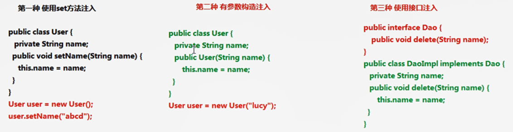

# Day1：Spring基本概念

## Quick insight：

1. Spring是一个开源轻量级框架
2. Spring核心：
   1. AOP：面向切面编程， 扩展功能不是修改源代码实现
   2. IOC：控制反转：
      - 比如有一个类，在类里有一个方法，（不是静态的）调用类的方法，创建类的对象，使用对象调用方法，创建类对象的过程，需要new一个对象；
      - 把对象的创建，不是通过new的方式实现，而是交给spring配置创建类对象；
3. Spring是一站式框架：
   1. Spring在java的三层结构中，每一层都提供不同的解决技术：
      - web层： spring MVC
      - service层：spring的IOC
      - dao层：spring的jdbc template（java database connectivity)

---

### Spring的IOC操作：

1. 把对象的创建交给spring管理

2. ioc操作两部分：

3. 1. ioc的配置文件的方式
   2. ioc的注解方式

### IOC底层原理：

1. ioc底层原理使用的技术

2. 1. xml配置文件
   2. dom4j解析xml
   3. 工厂设计模式
   4. 反射


---

## IOC入门案例：

#### 第一步 导入jar包：

1. ​    解压jar包： 都有三个jar包，jar，javadoc.jar， sourcecode
2. 做spring基本功能，导入四个核心的jar
3. 支持日志输出的jar包


#### 第二步 创建类， 在类里创建方法

1. spring核心配置文件名称和位置不是固定的

2. - 建议放在src

3. 引入schema约束

4. 配置对象的创建: `<bean id ='user' class="path to class"></bean>`

#### 第三步 创建spring配置文件，配置创建类

#### 第四步 写代码测试对象创建


------

## Spring 的bean管理 （xml配置文件）

### bean实例化三种方式

1. #### 1. 在sping里面通过配置文件创建对象

2. 1. 1. 使用类的无参数构造创建

```
<bean id ='user' class="path to class"></bean>

类里面没有无参数构造，会出现异常
```

1. 1. 2. 静态工厂： 创建静态方法，返回类对象

1. 1. 3. 实例工厂： 创建不是静态的方法，返回类的对象

   2. ### bean标签常用属性：

- - **id**属性：起的名称，任意命名，不能有特殊字符；根据id得到对象

  - **class**属性：创建对象所在的全路径

  - **name**属性：功能和id属性一样，name可以包含特殊符号

  - **scope**属性：

  - - singleton：default， 单例
    - prototype：  多实例
    - request： 创建对象把对象放到request里
    - session： 创建对象把对象放到session里
    - globalSession： 创建对象把对象放到globalSession里

#### 属性注入方式介绍：

- - 创建对象的时候，给类里面输入值；

  - 属性注入的方式：

  - - ***使用set方法注入；***
    - ***有参数构造注入：***
    - 使用接口注入：



#### spring注入属性（有参构造和set方法）

- - 有参构造

  - set方法：

  - - `<property name="属性的名字" value ="value"></property>`
    - 属性可以是对象；

#### spring注入对象类型属性

- - 在service中得到dao

  - 具体实现：

  - - 在service里面把dao作为类型属性
    - 生成dao类型属性的set方法
    - 配置文件完成注入
    - <property name="属性的名字" ref ="要注入的class配置的id值"></property>

1. p名称空间注入

---

### IOC 和DI 区别：

- IOC： 控制反转，把对象创建较给spring进行配置；
- DI：依赖注入，向类里面的属性中设置值；
- 关系：依赖注入不能单独存在，需要在ioc的基础上完成操作

---

## Spring整个web项目原理：

- 加载spring核心配置文件

- - new对象，功能可以实现，效率低

- 实现思想：把加载配置文件和创建对象过程，在服务器启动时完成；

- 实现原理

- - ServletContext对象

  - 监听器

  - 具体使用：

  - - 在服务器启动时，为每个项目创建一个servleContext对象
    - 在sevletContext对象创建时，使用监听器可以具体到servletXontext对象在什么时候创建
    - 使用监听器监听到servletContext对象创建时，架子啊spring配置文件，把配置文件配置对象创建
    - 把创建出来的对象放到servleContext域对象里，seAtribute方法
    - 获取对象时，到servleContext域得到，getAttribute方法 