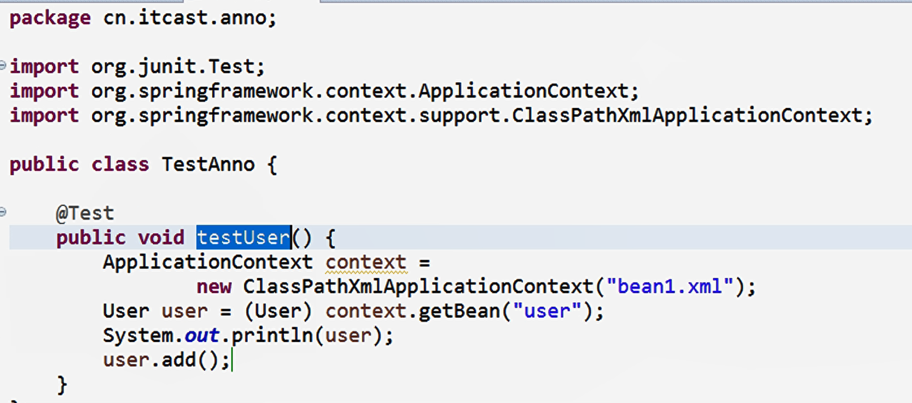

# 注解

## Spring的bean管理 （注解）

- 使用注解创建对象
- 使用注解注入属性
- xml和注解方式混合使用

**注解**：

1. 代码里面的特殊标记，使用注解可以完成功能
2. 注解写法 @注解名称（属性名称=属性值）
3. 注解可以用在类，方法，属性上面

### Spring注解开发准备：

1. 导入jar包： 

2. 1. 导入基本jar包
   2. 导入AOP的jar包

3. 创建类，创建方法

4. 创建spring配置文件，引入约束

5. 1. 第一天做ioc基本功能，引入约束spring-beans.xsd
   2. 做spring的AOP注解开罚，引入新的约束：spring-context.xsd

6. 开启注解扫描：

7. 1. 到包里面扫描类，方法，属性上面是否有注解
   2. <context:component-scan base-package="cn.itcase.anno"></ context:component-scan>

## A. 使用注解创建对象：

### 1. 在创建对象类上面用使用注解实现：

```
@Component(value="user)  //<bean id="user" class="/>
@Scope(value="prototype") //声明是创建的对象是单实例还是多实例
public class User {
}
```

### 2. 创建对象有四个注解： 

```
Spring中提供@Component的三个衍生注解：（功能目前来讲是一致的）
    * @Controller  ：web层
    * @Service     ：业务层
    * Repository   ：持久层
```

1. @Component
2. @Controller
3. @Service
4. @Respository
5. 这四个注解功能是一样的，都创建对象

### 测试代码



---

## B. 使用注解注入属性

### 1. 创建Service类，创建dao类，在service中想得到dao的对象

- - 注入属性： @Autowired
  - 注入属性第二个方式： @Resource（name=“注入对象的id”）要指定注入对象的值

```
1. 先分别创建UserService和UserDao对象类，用@Component / @Service
    @Component(value="userDao")
    public class UserDao{}

    @Service(value="userService")
    public class UserService{}

    
2. 在Service中创建dao类型属性
    //在dao属性上面使用注解 完成对象注入
    @Autowired //根据类名去完成注入

    //name中写的是创建的对象的value值
    @Resource(name="userDao")

    private UserDao userDao；
    //使用注解方式时不需要set方法
```

#### 配置文件和注解混合使用:

1.创建对象操作使用配置文件方式实现

2.注入属性的操作使用注解的方式实现


### 2. AOP

- AOP概述
- AOP底层原理
- AOP操作相关术语

#### AOP概述

1. aop: 面向切面（方面）编程 ， 扩展功能不修改源代码实现

2. AOP采取横向抽取机制，取代了传统纵向继承体系重复性代码

3. AOP底层使用动态代理实现：

4. 1. case1： 有接口情况，使用动态代理创建接口实现类代理对象：
   2. case2：没有接口情况，使用动态代理创建类的子类代理对象；

#### AOP底层原理

- **纵向机制**


- **横向抽取机制**：


### AOP操作相关术语

- Pointcut：切入点 
- 连接点： 类里面可以被增强的方法，
- Advice：增强 
- Aspect:切面


----

## C. Sping的AOP操作（基于aspectj的xml方式）

-  aspectj：是一个面向切面(AOP)的框架，扩展了java语言。

- - sping2.0以后新增了对Aspectj切点表达式支持。 
  - apectj不是sping的一部分，和spring一起用进行AOP操作；

- 使用aspectj实现AOP有两种方式：

1. 1. 基于aspectj的xml配置
   2. 基于aspectj的注解方式

### AOP操作准备：

1. 除了导入基本的jar包，还要导入和aspectj有关的jar包
2. 导入AOP的约束：spinf-aop.xsd

### 使用表达式配置切入点：

1. 切入点：试积增强的方法
2. 常用的表达式（expression） ：

```
execution(<访问修饰符>?<返回类型><方法名>(<参数>)<异常>)
```

（1） execution(* cn.itcast.aop.Book.add(...)) // * 是访问修饰符， 后面是class的全路径和需要增强的方法名add，..表示add的arguments

（2）execution(* cn.itcast.aop.Book.*(...)) // Book这个class中的所有方法

（3）execution(* *.*(...)) // 

（4）匹配所有save开头的方法 execution(* save*(..))


环绕的方法：


环绕配置：


---

## D. log4j介绍

1. 通过log4j可以看动程序运行过程中更详细的运行信息；

2. 1. 经常使用log4j查看日志
   2. 

3. 使用

4. 1. 导入log4j的jar包
   2. 复制log4j的配置文件，复制到src中

5. 设置日志级别： 

```
log4j.rootLoggr=info, stdour
```

（1） info：看到基本信息

（2)debug：看到更详细的信息